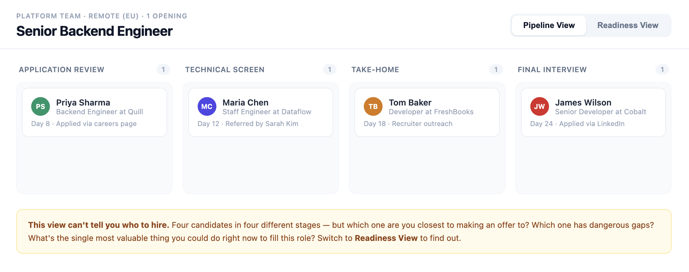
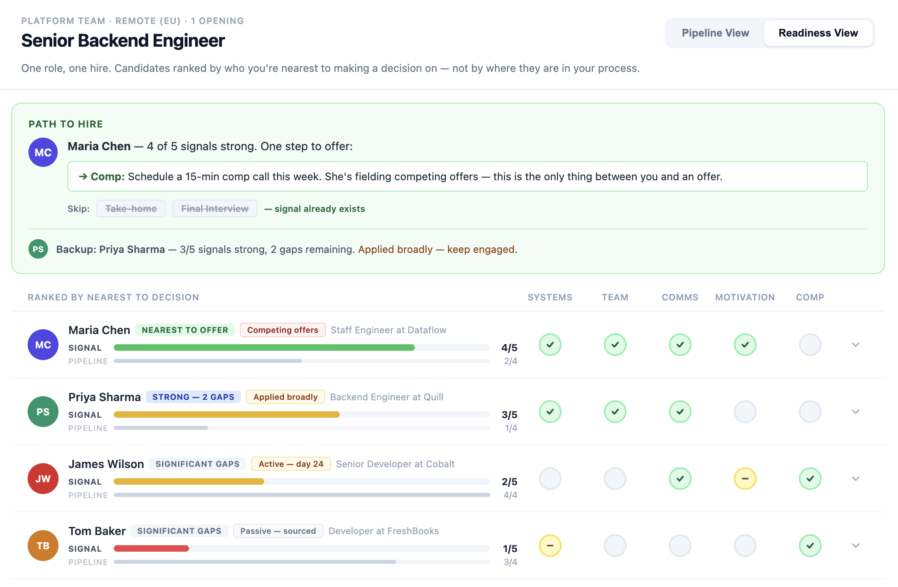
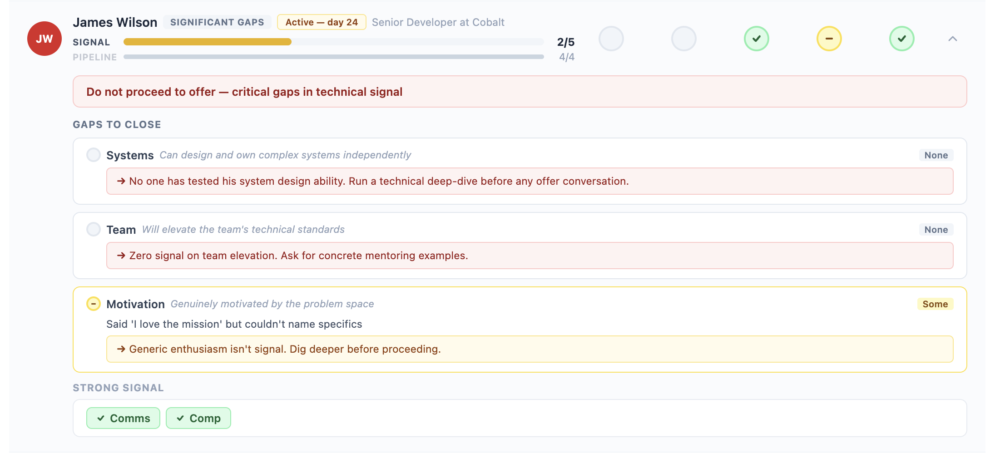

# Kill the Pipeline (as a decision tool)

**Thesis:** Hiring pipelines track where candidates are in your process. They don't track what you actually know about them. These are different things, and confusing them causes two specific failures: you lose strong candidates to unnecessary process, and you advance weak candidates on vibes.

[](https://stackblitz.com/github/igorpreston/kill-the-pipeline)

## The Problem

Pipelines are borrowed from sales funnels. They model a linear sequence: Application → Screen → Take-home → Final → Offer. Every candidate walks the same path regardless of what you already know about them.

This creates two failure modes that compound each other:

**Failure 1 — Speed: Strong candidates are slowed by mandatory process.**

Maria is a Staff Engineer referred by your tech lead. She has a strong open-source portfolio, speaks at conferences, and her referrer says she's the best async communicator they've worked with. You have evidence on almost everything that matters for this hire. But the pipeline says "Technical Screen is next," so she waits while you coordinate schedules. On day 8, she accepts another offer. Your pipeline looked healthy. You lost your best candidate.

**Failure 2 — Quality: Weak candidates advance undetected.**

James is personable and interviews well. He moved through Phone Screen, then Technical Screen (which tested communication, not technical depth), then Take-home (which was reviewed superficially). He's now in Final Interview — one step from an offer. But nobody has actually tested his system design ability or whether he elevates teams. The pipeline says he's almost done. The evidence says you barely know him. This is how bad hires happen.

Both failures share a root cause: **the pipeline measures progress through process, not progress toward a decision.** Stage 4 doesn't mean "ready to decide." It means "completed 4 activities." These are different things, and the pipeline makes them look identical.

## The Concept

**Replace the pipeline as the decision-making structure** during the active evaluation phase. Not for logistics — pipelines are fine for scheduling interviews and tracking process. Replace it for the moment that matters most: when you're deciding who to hire.

For each role, define **signals** — the 4-6 areas you need confidence in before extending an offer. For a Senior Backend Engineer: Systems Design, Team Elevation, Communication, Motivation, Compensation.

For each candidate, track signal strength: **Strong** (you have clear evidence), **Some** (partial or unverified), **None** (no data). Evidence comes from anywhere — resumes, interviews, portfolios, references, public work. It doesn't have to come from a formal stage.

The **Readiness View** then shows candidates ranked by who you're nearest to making a decision on. Each candidate has a visual comparison: signal coverage vs. pipeline position. When these diverge, you see it immediately — Maria has 4/5 signals strong but is stuck in Stage 2. James has 2/5 signals strong but is in Stage 4.

The critical output: for your lead candidate, the view shows which stages can be **skipped** because signal already exists, and what the **single next action** is to close remaining gaps. This is something a pipeline structurally cannot produce.

This prototype is a lean exploration of that idea. It's designed to test whether the insight — pipeline position ≠ decision readiness — holds up visually and conceptually, before investing in a full implementation. If it resonates, the next iterations are clear (signal definition, AI-assisted evidence entry, audit trails). If it doesn't, we learned that in hours, not months.

### What this is NOT

- **Not a replacement for the pipeline.** The pipeline handles logistics. This handles decisions. They coexist.
- **Not AI scoring candidates.** AI never evaluates people. Signal strength is confirmed by the hiring manager, always.
- **Not a scorecard.** Scorecards evaluate backward ("rate this interview 1-5"). Signals drive forward ("what do I still need to learn, and what's the fastest way to learn it?"). Scorecards live inside stages. Signals replace stages as the organizing structure.

## What I Chose Not to Build

The via negativa reasoning was central to arriving at this concept. Here's what I eliminated and why:

**Not a chatbot or conversational AI agent.** Everyone will build this. A chat interface over a pipeline is still a pipeline — you've changed the input method, not the model.

**Not a confidence score.** "Candidate readiness: 78%" is dangerous. It collapses multidimensional judgment into a single number that conceals more than it reveals. It also creates legal risk — automated scoring in hiring is increasingly regulated (EU AI Act). I chose explicit per-signal evidence over aggregated scores.

**Not a more complex UI.** Pipelines are popular because they're simple. Kanban boards give you instant gestalt. The replacement must be at least as simple, not more complex. A radar chart with 8 dimensions × 50 candidates fails on contact with reality. I constrained the design to be scannable at a glance.

**Not a full-funnel replacement.** Pipelines work for top-of-funnel logistics. The Readiness View targets the decision phase — typically 4-8 candidates in active evaluation. This scoping was deliberate: going deep on one moment of high leverage rather than shallow across the entire hiring flow.

**No AI features in the prototype.** AI was central to this project — but in the product thinking, not the UI. Bolting a "Suggest signals" button onto the prototype would be a gimmick: a mock interaction that doesn't prove the concept. The insight that pipeline position ≠ decision readiness is structural. It needs to be demonstrated structurally, not dressed up with an API call. The AI-powered features (signal suggestion from job descriptions, evidence extraction from interview notes) are real and valuable — they belong in the next iteration, once the core concept is validated.

## How the Prototype Works

The prototype is a single React page with mock data for one role (Senior Backend Engineer) and four candidates. Toggle between two views:

**Pipeline View** shows the familiar Kanban: 4 stages, candidates distributed across them. It looks orderly. Maria is in Stage 2. James is in Stage 4.



**Readiness View** reorders the same candidates by signal coverage, revealing the truth:

- **Maria Chen** (Stage 2, Signal 4/5) — tagged "Nearest to offer" with "Competing offers" urgency. The Path to Hire banner says: one signal remaining (Comp), and explicitly shows crossed-out stages she should skip: ~~Take-home~~, ~~Final Interview~~. Signal already exists.
- **Priya Sharma** (Stage 1, Signal 3/5) — tagged "Strong — 2 gaps." Stuck at Application Review despite strong public evidence. Needs motivation and comp conversations.
- **Tom Baker** (Stage 3, Signal 1/5) — tagged "Significant gaps." 18 days in process with almost nothing learned. Process running without learning.
- **James Wilson** (Stage 4, Signal 2/5) — tagged "Significant gaps" with "Active — day 24" urgency. About to receive an offer with zero technical validation. Expanding reveals two urgent red flags.



Expanding any candidate shows **gaps first** (with specific next actions) and **strong signals compressed** into a chip row. The hierarchy is: what you need to do > what's already resolved.



**The 30-second demo story:** Pipeline looks fine → switch to Readiness → Maria is #1 (not James) → Path to Hire says skip stages and resolve comp → expand James to see he's about to get an offer with no technical evidence → the pipeline was lying to you.

## AI Usage

I used AI (Claude) extensively as a thinking partner throughout this project:

- **Concept exploration:** Brainstormed multiple approaches to replacing pipelines (confidence scores, evidence boards, time-decay models, constraint elimination, comparative tournaments). Used via negativa reasoning to eliminate approaches systematically.
- **Critical evaluation:** Ran adversarial evaluations against the concept from multiple perspectives — product reviewer, HR manager, hostile skeptic. Each round surfaced specific weaknesses: "isn't this just scorecards?" led to rethinking the entire framing. "Who is this actually for?" led to scoping to the decision phase rather than the full funnel. "Would you actually use this on a Monday morning?" led to the one-role-one-hire focus.
- **Implementation:** Used AI for writing the React prototype. The code is straightforward — the value is in the concept and data design, not the implementation complexity.
- **Iterative refinement:** Six build → critique → refine cycles, where each critique surfaced a specific flaw that led to a non-obvious design change. Examples: the scorecards challenge revealed that "questions answered" sounded like a checklist, leading to the shift to "signals" (observational, not evaluative). An HR manager review pointed out the prototype *showed* the mismatch but never *resolved* it — leading to the crossed-out stages in Path to Hire, which became the prototype's strongest moment. A product review identified that "Lead candidate" implied quality ranking when we were actually ranking decidability — a subtle but important distinction that changed the labels and the whole framing of what the sort means.

The assignment asks how AI changes what's possible. Here's my answer: AI compressed what would normally be weeks of product exploration — brainstorming, elimination, user perspective analysis, adversarial testing — into a few hours. The prototype doesn't contain AI features, but it wouldn't exist without AI. Every major design decision was shaped by AI-assisted critical evaluation. That's the higher-leverage use of AI in product work: not autocompleting a text field, but stress-testing whether you're solving the right problem before you write a line of code.

## Tradeoffs & Limitations

**All signals are weighted equally.** The prototype counts "strong" signals and ranks by the count. But "Systems Design: none" for a backend engineer is a dealbreaker, while "Compensation: none" is an open conversation. In the full product, signals would have must-have/nice-to-have tiers, and a missing dealbreaker would block "ready to decide" regardless of how many other signals are strong.

**Signal strength is subjective.** "Strong" means the hiring manager has enough evidence to feel confident. Two managers might disagree. Two interviewers might provide conflicting assessments. The prototype treats each signal as a single truth. Production would need multi-assessor input and disagreement surfacing.

**The mock data is designed to illustrate the argument.** Maria is specifically constructed to show "ahead of process," James to show "behind on evidence." In reality, the mismatch may not always be this dramatic. The concept is most valuable when signal comes from diverse sources (referrals, portfolios, public work) that the pipeline doesn't account for. In pipelines where every stage efficiently generates new signal, the mismatch may be rarer.

**Compliance tension.** In many companies — especially in the EU — hiring processes are structured for fairness and defensibility. "We skipped 2 stages for Candidate A but not Candidate B" needs justification. The signal framework provides this ("we already had evidence in these areas from these sources") but it would need audit-trail support in production.

**The view is diagnostic, not actionable.** You see "Schedule a comp call for Maria," but then you leave the Readiness View and open your calendar. In production, next actions would connect to scheduling, note-taking, and feedback collection — the view becomes a workflow, not just a dashboard.

**This is an "is this just a fancy reorder?" question.** Honestly: the visible output is a reorder. Candidates sorted by signal coverage instead of pipeline stage. But the reorder is only possible because of the signal model underneath — the defined-per-role framework for what "ready to decide" means. Without that framework, you can't identify gaps, recommend next actions, or say "skip these stages." The sort is the output. The signal model is the innovation.

## What I'd Do Next

With 2 more days:

**Day 1 — Signal definition flow.** When opening a new role, define the signals that matter. AI suggests initial signals from the job description. The hiring manager edits, reorders, marks must-haves. This closes the loop on "where do signals come from?" and makes the concept self-contained.

**Day 1 — Evidence entry after interviews.** Paste interview notes → AI suggests which signals the notes address and extracts key evidence snippets → hiring manager confirms or rejects. This is the main AI-powered interaction and the primary way signals move from "none" to "some" to "strong."

**Day 2 — Multi-role dashboard.** A view across all open roles showing: which roles have a candidate nearest to offer, which roles are stalled (lots of pipeline activity, little signal accumulation), and where your recruiting energy is being wasted vs. where it's most needed.

**Day 2 — Audit trail.** Every signal status change is logged with who confirmed it and what evidence supported it. This addresses the compliance concern and builds the defensibility record that skipping stages requires.

## Setup

**Quickest — run in browser (no install):**

[](https://stackblitz.com/github/igorpreston/kill-the-pipeline)

**Run locally:**

```bash
git clone https://github.com/igorpreston/kill-the-pipeline.git
cd kill-the-pipeline
npm install
npm run dev
```

No backend. No API keys. No environment variables. The prototype is a single React component (`src/App.jsx`) running in a standard Vite + React setup.

## Time Spent

~4 hours total.

- ~1.5 hours: Concept exploration, via negativa reasoning, problem definition
- ~1.5 hours: Prototype implementation and iterative refinement (6 iterations)
- ~1 hour: Critical evaluation rounds, README writing
